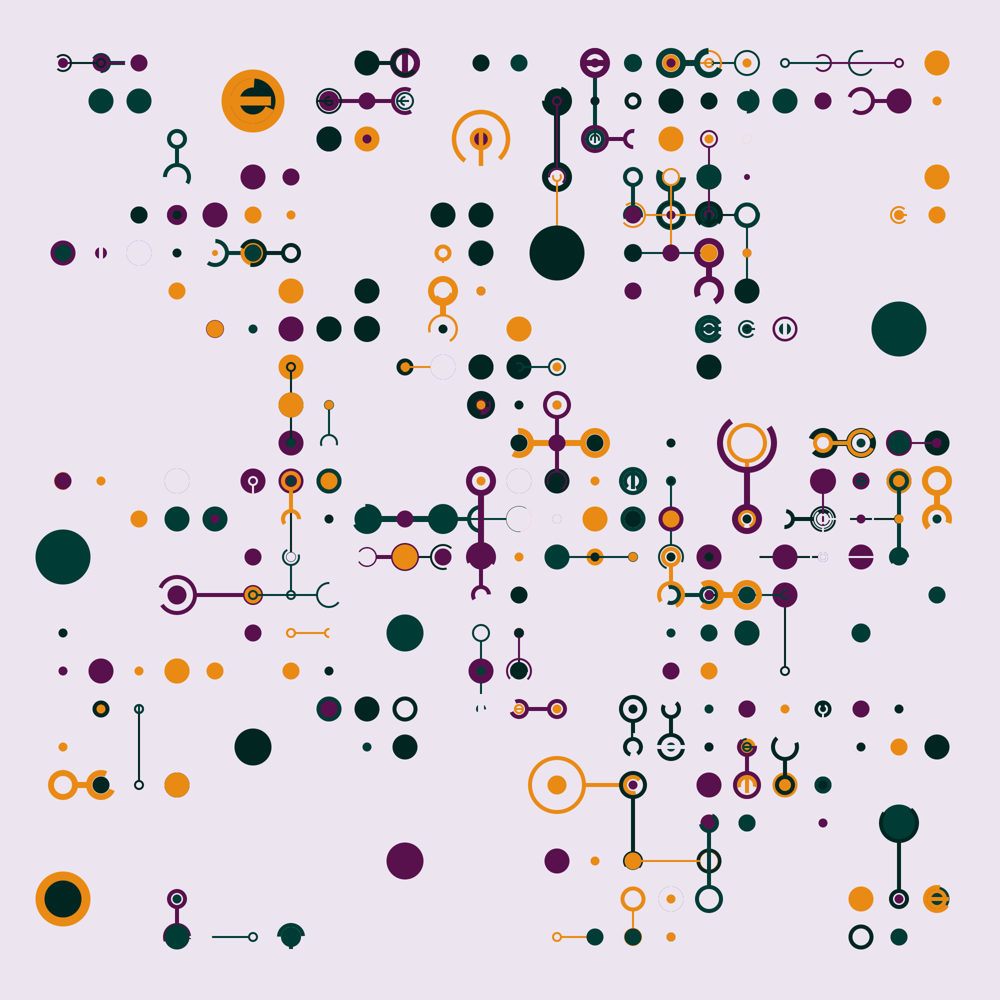

# The Webonomicon

An Introduction to Web Programming for Weary Data Scientists

  

    
  

  

This tutorial is a short introduction to web programming using modern tools and practices
for data scientists who are comfortable using Python
but have never built interactive websites before.
All of the material is available under [open licenses](./LICENSE.md),
and contributions through our [GitHub repository][repo] are welcome.
All contributors are required to respect our [Code of Conduct](./CODE_OF_CONDUCT.md).

> **Please note:** this tutorial is still being outlined.
> Most sections will have additional examples (and much more explanation)
> before learners encounter it.
> Suggestions and help are greatly appreciated.

  

## Learner Persona

-   Sabina, 28, has a master's degree in animal physiology
    and now works for a mid-sized veterinary pharmaceutical company.
-   She learned a bit of R in an undergraduate biostatistics course,
    then picked up Python in grad school.
    She spends several hours a week analyzing data with [Pandas][pandas]
    and visualizing it with [Plotly Express][plotly-express],
    and is comfortable with basic Git commands.
-   Sabina recently became responsible for maintaining a dashboard application built with [Dash][dash].
    She believes a better understanding of how web applications work in general
    will help her debug and extend it.
-   Sabina has tried doing asynchronous online courses a couple of times,
    but strongly prefers learning in real time with other people.

## Syllabus

<ol class="chapters" markdown="1">

1.  [Introduction](./01_intro/index.md): what we will learn, how to set up, and the data we will use
1.  [HTTP](./02_http/index.md): how browsers and server talk to each other
1.  [A Server](./03_server/index.md): building a server with [Flask][flask]
1.  [Using a Database](./04_db/index.md): getting data from [SQLite][sqlite] using [PyPika][pypika]
1.  [Testing the Server](./05_test/index.md): testing the server with [pytest][pytest]
1.  [Serving HTML](./06_html/index.md): generating HTML with [Jinja][jinja] templates
1.  [Using Forms](./07_forms/index.md): sending data to a server
1.  [An Hour of JavaScript](./08_js/index.md): variables, loops, functions, and callbacks
1.  [JavaScript in the Browser](./09_browser/index.md): using the language in its native habitat
1.  [Using HTMX](./10_htmx/index.md): letting the [htmx][htmx] library do the hard work
1.  [Database Migration](./11_migrate/index.md): managing database schema changes
1.  [Permissions](./12_perm/index.md): representing and checking who can do what
1.  [Authentication](./13_auth/index.md): checking the user's identity
1.  [Encryption](./14_crypt/index.md): keeping secrets safe
1.  [Testing in the Browser](./15_test/index.md): using [Selenium][selenium] to test the user interface
1.  [Dynamic Graphics](./16_graphics/index.md): drawing pictures with [SVG.js][svgjs]
1.  [A Graphical User Interface](./17_gui/index.md): handling interactivity in the browser
1.  [Accessibility](./18_access/index.md): because everyone should be comfortable
1.  [Internationalization](./19_intl/index.md): because everyone should be welcome
1.  [Logging and Auditing](./20_log/index.md): keeping of track of what's happened
1.  [Session](./21_sessions/index.md): persistent sessions and [JWT][jwt]
1.  [Designing a Workflow](./22_workflow/index.md): thinking before coding

</ol>

##  Appendices

<ol class="appendices" markdown="1">

1.  [HTML and CSS](./98_htmlcss/index.md)
1.  [Certificates](./99_cert/index.md)
1.  [Bibliography](./bibliography.md)
1.  [Glossary](./glossary.md)
1.  [Contributing](./CONTRIBUTING.md)

</ol>

## Technologies

| Package                          | Purpose           |
| -------------------------------- | ----------------- |
| [Alpine.js][alpine]              | dynamic HTML      |
| [Beautiful Soup][bs4]            | HTML manipulation |
| [deno][deno]                     | JavaScript        |
| [Flask][flask]                   | web server        |
| [Frappe Charts][frappe-charts]   | charts            |
| [html5validator][html5validator] | validation        |
| [htmx][htmx]                     | interaction       |
| [httpx][httpx]                   | HTTP              |
| [Jinja2][jinja]                  | HTML templating   |
| [Polars][polars]                 | tabular data      |
| [PrettyTable][prettytable]       | formatting        |
| [PyPika][pypika]                 | query builder     |
| [pytest][pytest]                 | testing           |
| [Selenium][selenium]             | testing           |
| [SQLite][sqlite]                 | database          |
| [SVG.js][svgjs]                  | graphics          |

[alpine]: https://alpinejs.dev/
[bs4]: https://beautiful-soup-4.readthedocs.io/
[dash]: https://dash.plotly.com/
[deno]: https://deno.com/
[flask]: https://flask.palletsprojects.com/
[frappe-charts]: https://frappe.io/charts/docs
[html5validator]: https://pypi.org/project/html5validator/
[htmx]: https://htmx.org/
[httpx]: https://www.python-httpx.org/
[jinja]: https://jinja.palletsprojects.com/
[jwt]: https://en.wikipedia.org/wiki/JSON_Web_Token
[pandas]: https://pandas.pydata.org/
[plotly-express]: https://plotly.com/python/plotly-express/
[polars]: https://pola.rs/
[prettytable]: https://pypi.org/project/prettytable/
[pypika]: https://pypika.readthedocs.io/
[pytest]: https://docs.pytest.org/
[repo]: https://github.com/gvwilson/web-tutorial
[selenium]: https://pypi.org/project/selenium/
[sqlite]: https://www.sqlite.org/
[svgjs]: https://svgjs.dev/
